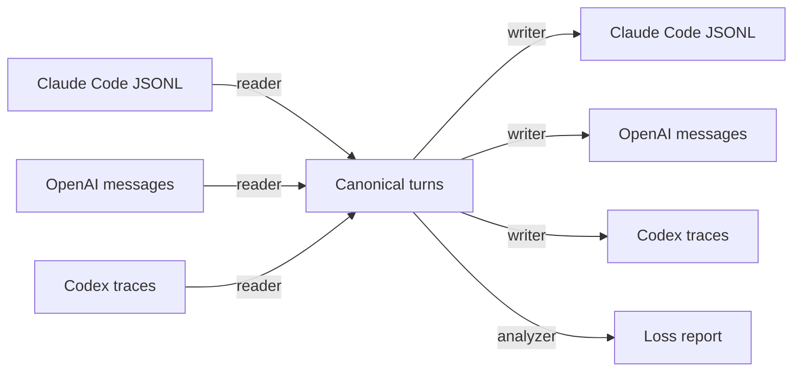
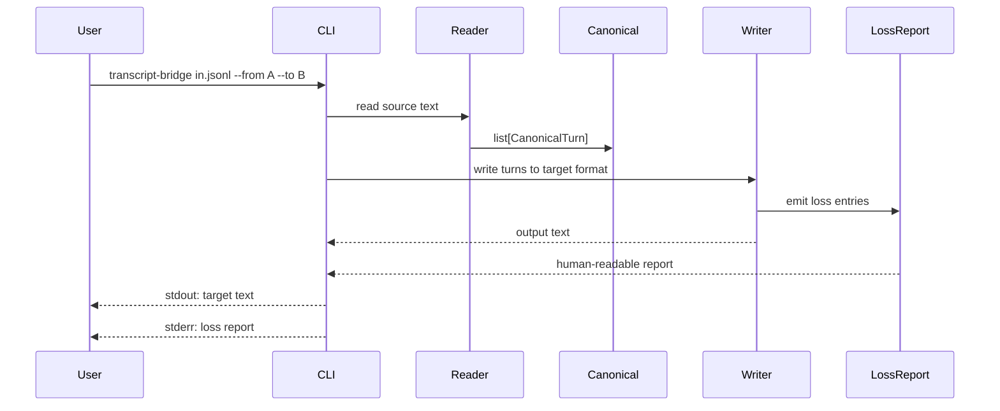

# transcript-bridge

**Loss-aware, vendor-neutral transcript format conversion for AI agents.**

Convert agent session logs between Claude Code JSONL, OpenAI messages, Codex traces, and a canonical JSONL — without silently dropping metadata. Run with Claude, replay with OpenAI, analyze with Codex, and know exactly what survived the trip.


---

## Table of contents

1. [The problem it solves](#the-problem-it-solves)
2. [The methodology](#the-methodology)
3. [How it works (mechanism)](#how-it-works-mechanism)
4. [The canonical format](#the-canonical-format)
5. [Install](#install)
6. [Usage](#usage)
7. [Supported formats](#supported-formats)
8. [Loss model](#loss-model)
9. [Project layout](#project-layout)
10. [Security](#security)
11. [Scope (v1)](#scope-v1)
12. [Self-check](#self-check)
13. [License](#license)

---

## The problem it solves

Agent stacks are multiplying, and each one records conversations differently. Switching formats for debugging, replay, or analysis usually means **losing information silently**.

| Without transcript-bridge | With transcript-bridge |
|---|---|
| Convert Claude → OpenAI and lose `cache_control` silently | Every lost field is reported to stderr |
| Replay a Codex trace in Claude and drop `usage`/`checkpoint` metadata | Extra fields are stashed in `_meta.source` and re-emitted when possible |
| Round-trip a transcript and find the output no longer matches the input | `selfcheck.py` proves round-trip honesty |
| Audit which format dropped what | Loss report gives path, reason, source format, target format, and value |

The key idea: **you don't change the agent. transcript-bridge normalizes the transcript.**

---

## The methodology

Three design choices keep the tool small, honest, and composable:

1. **Canonical-first, not format-first.**  
   Every input is normalized into one vendor-neutral envelope. Writers translate the canonical model, not each pairwise format difference.

2. **Block arrays as the source of truth.**  
   Anthropic-style content blocks (`text`, `tool_use`, `tool_result`) preserve ordering of text, tools, and cache hints in a single list. OpenAI's `tool_calls`/`role: tool` shape is derived from that list.

3. **Loss is a first-class output.**  
    `--strict` turns any loss into a non-zero exit. Loss entries are stored in `_meta.loss` so the canonical record remembers what could not be represented.



---

## How it works (mechanism)



The pipeline has three stages:

- **Reader** parses source text into canonical turns.
- **Canonical envelope** stores each turn as a JSONL line with `role`, `content`, derived `tool_calls`/`tool_results`, provider/model hints, timestamp, and `_meta`.
- **Writer** re-serializes turns into the target format and reports any field with no native home.

Nothing is silently dropped. Unknown fields go into `_meta.source`; unsupported fields become loss entries.

---

## The canonical format

One JSONL line per conversation turn:

```jsonl
{"role":"assistant","content":[{"type":"text","text":"hello"},{"type":"tool_use","id":"call_1","name":"Read","input":{"file_path":"/x"}}],"tool_calls":[{"type":"tool_use","id":"call_1","name":"Read","input":{"file_path":"/x"}}],"tool_results":null,"provider":"anthropic","model":null,"ts":"2026-07-22T12:00:00+00:00","_meta":{"loss":[],"source":{}}}
{"role":"tool","content":[{"type":"tool_result","tool_use_id":"call_1","content":"contents"}],"tool_calls":null,"tool_results":[{"tool_use_id":"call_1","content":"contents"}],"provider":"openai","model":null,"ts":"2026-07-22T12:00:01+00:00","_meta":{"loss":[],"source":{"role":"tool","tool_call_id":"call_1","content":"contents","name":"Read"}}}
```

### Fields

| Field | Meaning |
|---|---|
| `role` | `user`, `assistant`, `system`, `tool` |
| `content` | Canonical truth: string or array of Anthropic-style blocks |
| `tool_calls` | Derived view of `tool_use` blocks inside `content` |
| `tool_results` | Derived view of `tool_result` blocks inside `content` |
| `provider` | Source provider hint: `anthropic`, `openai`, `codex`, ... |
| `model` | Model name if known |
| `ts` | ISO-8601 timestamp |
| `_meta` | Always present. Holds `loss` entries and `source` record. |

---

## Install

```bash
pipx install .
# or install directly from GitHub:
pipx install git+https://github.com/Victorchatter/transcript-bridge.git
```

Requires Python 3.10+. Zero runtime dependencies.

To run from source:

```bash
python -m transcript_bridge.cli formats
```

---

## Usage

### Convert a Claude Code transcript to OpenAI messages

```bash
transcript-bridge session.jsonl --from claude_code_jsonl --to openai_messages -o session-openai.json
```

The file output:

```json
[
  {
    "role": "assistant",
    "content": "I'll read that.",
    "tool_calls": [
      {
        "id": "tu_1",
        "type": "function",
        "function": {
          "name": "Read",
          "arguments": "{\"file_path\":\"/x\"}"
        }
      }
    ]
  },
  {
    "role": "tool",
    "tool_call_id": "tu_1",
    "content": "file contents"
  }
]
```

The stderr report:

```
loss report: 1 field(s) could not be represented
  - content text cache_control: OpenAI messages have no slot for Anthropic cache_control blocks
```

### Fail on loss

```bash
transcript-bridge session.jsonl --from claude_code_jsonl --to openai_messages --strict
# exits with code 2 if any loss occurred
```

### Read from stdin

```bash
cat session.jsonl | transcript-bridge - --from claude_code_jsonl --to codex
```

### List supported formats

```bash
transcript-bridge formats
```

---

## Supported formats

| Format | Read | Write | Notes |
|---|---|---|---|
| `claude_code_jsonl` | ✅ | ✅ | Anthropic-style content blocks (`text`, `tool_use`, `tool_result`) |
| `openai_messages` | ✅ | ✅ | JSON array of `{role, content, tool_calls}` messages |
| `codex` | ✅ | ✅ | Codex CLI traces with extra metadata (`usage`, `checkpoint`, etc.) |

Adding a new format means adding a reader + writer module and one registry line.

### Conversion matrix (field survival)

Derived from the actual readers/writers in `transcript_bridge/formats/*.py` and `canonical.py` / `loss.py`. Rows are canonical fields; columns are target formats. A field is **kept** when it appears in the target output, **loss (reported)** when a loss entry is emitted to stderr / `_meta.loss`, or **stashed in _meta** when it has no native slot and is preserved only on the canonical turn's `_meta` (no loss entry, silently dropped from the serialized target text).

| Canonical field | → Claude Code JSONL | → OpenAI messages | → Codex | → canonical |
|---|---|---|---|---|
| `cache_control` | kept | loss (reported) | loss (reported)¹ | kept |
| `tool_use` / `tool_calls` | kept | kept | kept | kept |
| `tool_result` | kept | kept | kept | kept |
| `usage` | stashed in _meta | stashed in _meta | kept (re-emitted)² | stashed in _meta |
| `checkpoint` / `metadata` | stashed in _meta | stashed in _meta | kept (re-emitted)² | stashed in _meta |
| OpenAI tool `name` | loss (reported)³ | kept | kept | stashed in _meta |
| `timestamp` | kept | stashed in _meta | stashed in _meta | kept |
| `model` | kept | stashed in _meta | stashed in _meta | kept |

¹ Codex writing delegates to the OpenAI writer, so `cache_control` is reported as loss on the OpenAI sub-hop and propagates.
² Codex-only fields ride in `_meta.source._codex_extra`; the Codex writer re-injects them. They survive a Codex→Codex round-trip but are dropped when the turn is serialized through OpenAI text (the OpenAI writer does not report them as loss — they are stashed, not reported).
³ `role` itself is always kept; only the OpenAI-specific tool-message `name` field is reported as loss by the Claude Code writer.

> `--strict` fails (exit code 2) on any cell marked **loss (reported)**.

---

## Loss model

A loss entry is created whenever a canonical field has no native slot in the target format:

```json
{
  "path": "content[0].cache_control",
  "source_format": "claude_code_jsonl",
  "target_format": "openai_messages",
  "reason": "OpenAI messages have no slot for Anthropic cache_control blocks",
  "value": {"type": "ephemeral"}
}
```

### Common loss cases

| Source field | Target | Outcome |
|---|---|---|
| Claude `cache_control` | OpenAI / Codex | Reported as loss |
| OpenAI tool `name` | Claude Code JSONL | Reported as loss |
| Codex `usage`, `checkpoint` | OpenAI messages | Reported as loss (re-emitted when writing back to Codex) |

Loss entries are printed to stderr and stored in `_meta.loss` on each canonical turn.

---

## Project layout

```
transcript-bridge/
├── transcript_bridge/
│   ├── __init__.py          # version + FORMATS registry
│   ├── canonical.py         # canonical envelope + JSONL helpers
│   ├── loss.py              # loss entry + report formatting
│   ├── cli.py               # argparse CLI
│   └── formats/
│       ├── __init__.py
│       ├── claude_code.py   # Claude Code JSONL reader/writer
│       ├── openai.py        # OpenAI messages reader/writer
│       └── codex.py         # Codex trace reader/writer
├── selfcheck.py             # round-trip + loss-report verification
├── pyproject.toml           # pipx-installable, stdlib only
├── LICENSE                  # MIT
└── README.md
```

Source comments marked with `# ponytail:` are deliberate simplifications.

---

## Security

- **Read-only on inputs.** Source files are never modified.
- **No network calls.** The tool works fully offline.
- **No telemetry.** No hosted backend, no upload, no logging service.
- **Local only.** All processing happens on the machine that runs the CLI.

---

## Scope (v1)

**In:**
- Claude Code JSONL, OpenAI messages, Codex traces
- Canonical JSONL envelope
- Loss reporting with `--strict`
- CLI: `transcript-bridge <file> --from X --to Y [-o out] [--strict]`
- `transcript-bridge formats`
- One `selfcheck.py`, no external test framework
- Stdlib only; Python 3.10+

**Out:**
- Streaming/incremental conversion
- Binary attachment extraction
- Additional formats (Gemini, etc.)
- Merging multiple runs
- Web UI or hosted service
- Tape compression or rotation

---

## Self-check

A single runnable check proves round-trip honesty:

```bash
python selfcheck.py
```

It builds a canonical transcript with one Claude-specific field (`cache_control`) and one OpenAI-specific field (`name` on a tool message), then asserts:

1. Claude → Claude is lossless.
2. Claude → OpenAI reports exactly the `cache_control` loss.
3. OpenAI → Claude reports the `name` field as loss.
4. Claude → OpenAI → Claude preserves content except the expected lossy fields.

---

## License

MIT. See [LICENSE](./LICENSE).

Built to make agent transcripts portable. **Convert once, know exactly what made it across.**
