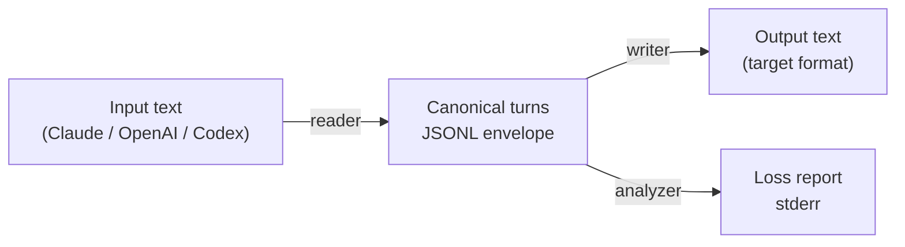
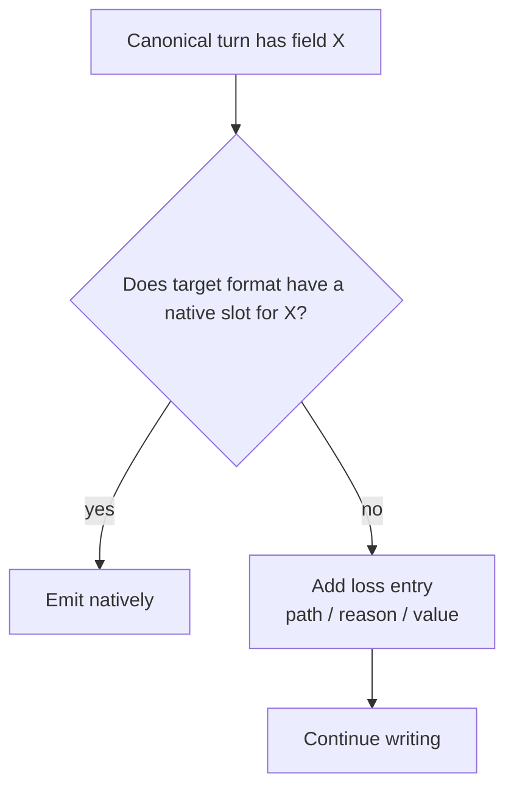

# transcript-bridge

**Loss-aware conversion between agent transcript formats.**

Convert session logs across Claude Code JSONL, OpenAI messages, Codex traces, and a canonical JSONL — without silently dropping metadata. Every field that cannot be represented in the target format is reported in a loss summary. Use `--strict` to fail on any loss.

```bash
# Convert a Claude Code transcript to OpenAI messages
transcript-bridge session.jsonl --from claude_code_jsonl --to openai_messages -o session-openai.json

# Loss report printed to stderr
loss report: 1 field(s) could not be represented
  - content text cache_control: OpenAI messages have no slot for Anthropic cache_control blocks
```

---

## Table of contents

1. [Why this exists](#why-this-exists)
2. [Supported formats](#supported-formats)
3. [Installation](#installation)
4. [Quick start](#quick-start)
5. [CLI reference](#cli-reference)
6. [Architecture & methodology](#architecture--methodology)
7. [Implementation](#implementation)
8. [Use cases](#use-cases)
9. [Performance](#performance)
10. [Development](#development)
11. [Contributing](#contributing)
12. [License](#license)

---

## Why this exists

Agent stacks are multiplying. Each one records conversations differently:

- **Claude Code** emits JSONL with Anthropic-style content blocks (`text`, `tool_use`, `tool_result`), `cache_control`, and per-turn metadata.
- **OpenAI** uses a flat array of `{role, content, tool_calls}` messages with `tool_call_id` and `name` fields.
- **Codex** produces OpenAI-like traces plus `usage`, `checkpoint`, `command`, `cwd`, and other CLI-specific fields.

Switching between these formats for debugging, replay, or analysis usually means **losing information silently**. `transcript-bridge` makes the loss explicit. It converts the conversation into a small canonical model, then re-serializes it into the target format while reporting every field that had no native home.

### What makes this different

| Concern | Typical converter | transcript-bridge |
|---|---|---|
| Silent data loss | Common | Never — every loss is reported |
| Round-trip honesty | Rare | Core design goal, validated by `selfcheck.py` |
| Local/offline | Sometimes | Always — stdlib only, no network |
| Telemetry | Often present | None |

---

## Supported formats

| Format | Read | Write | Notes |
|---|---|---|---|
| `claude_code_jsonl` | ✅ | ✅ | Anthropic-style content blocks (`text`, `tool_use`, `tool_result`) |
| `openai_messages` | ✅ | ✅ | JSON array of `{role, content, tool_calls}` messages |
| `codex` | ✅ | ✅ | Codex CLI traces with extra metadata (`usage`, `checkpoint`, etc.) |

Planned follow-up formats: Gemini transcripts, LangSmith traces.

---

## Installation

### pipx (recommended)

```bash
pipx install .
```

### pip

```bash
python -m pip install .
```

### Run from source

```bash
python -m transcript_bridge.cli formats
```

No external dependencies are required. The tool uses only the Python standard library.

---

## Quick start

### 1. List supported formats

```bash
transcript-bridge formats
```

Output:

```
claude_code_jsonl
codex
openai_messages
```

### 2. Convert a Claude Code transcript to OpenAI messages

Create a sample Claude Code JSONL file:

```bash
cat > session.jsonl <<'EOF'
{"type":"assistant","message":{"role":"assistant","content":[{"type":"text","text":"I'll read that.","cache_control":{"type":"ephemeral"}},{"type":"tool_use","id":"tu_1","name":"Read","input":{"file_path":"/x"}}]},"timestamp":"2026-07-22T12:00:00Z"}
{"type":"user","message":{"role":"user","content":[{"type":"tool_result","tool_use_id":"tu_1","content":"file contents"}]},"timestamp":"2026-07-22T12:00:01Z"}
EOF
```

Run the conversion:

```bash
transcript-bridge session.jsonl --from claude_code_jsonl --to openai_messages -o session-openai.json
```

Stdout/file output (`session-openai.json`):

```json
[
  {
    "role": "assistant",
    "content": "I'll read that.",
    "tool_calls": [
      {
        "id": "tu_1",
        "type": "function",
        "function": {
          "name": "Read",
          "arguments": "{\"file_path\":\"/x\"}"
        }
      }
    ]
  },
  {
    "role": "tool",
    "tool_call_id": "tu_1",
    "content": "file contents"
  }
]
```

Stderr output:

```
loss report: 1 field(s) could not be represented
  - content text cache_control: OpenAI messages have no slot for Anthropic cache_control blocks
```

### 3. Fail on loss

```bash
transcript-bridge session.jsonl --from claude_code_jsonl --to openai_messages --strict
# exits with code 2 because cache_control cannot be represented
```

### 4. Read from stdin

```bash
cat session.jsonl | transcript-bridge - --from claude_code_jsonl --to codex
```

---

## CLI reference

```
transcript-bridge <file> --from <fmt> --to <fmt> [-o out] [--strict]
transcript-bridge formats
```

| Argument | Description |
|---|---|
| `file` | Input file path, or `-` for stdin |
| `--from` | Source format (`claude_code_jsonl`, `openai_messages`, `codex`) |
| `--to` | Target format |
| `-o` | Output file (default: stdout) |
| `--strict` | Exit with code 2 if any loss occurs |

Exit codes:

- `0` — success, no loss (or loss ignored without `--strict`)
- `1` — invalid arguments, missing file, or read error
- `2` — loss occurred and `--strict` was used

---

## Architecture & methodology

### Pipeline



All conversions pass through a single canonical intermediate model:

```json
{
  "role": "user|assistant|system|tool",
  "content": "<string or block array>",
  "tool_calls": [...],
  "tool_results": [...],
  "provider": "anthropic|openai|codex",
  "model": "...",
  "ts": "...",
  "_meta": {
    "loss": [...],
    "source": {...}
  }
}
```

### Canonical design choices

- **`content` as the source of truth.** It is either a plain string or an ordered array of Anthropic-style blocks (`text`, `tool_use`, `tool_result`). This captures system turns and tool interactions in one ordered list.
- **Derived `tool_calls` and `tool_results`.** These are normalized views extracted from `content` for consumers that prefer OpenAI-style fields.
- **`_meta` always present.** It holds loss entries from the last write operation and the original source record for debugging.
- **Preserved ordering.** System turns and `cache_control` blocks stay in their original position inside `content`.

### Loss model



Each loss entry has the shape:

```json
{
  "path": "content[0].cache_control",
  "source_format": "claude_code_jsonl",
  "target_format": "openai_messages",
  "reason": "OpenAI messages have no slot for Anthropic cache_control blocks",
  "value": {"type": "ephemeral"}
}
```

---

## Implementation

### Project structure

```
transcript-bridge/
  transcript_bridge/
    __init__.py          # exports version and FORMATS registry
    canonical.py         # canonical envelope + JSONL helpers
    loss.py              # loss entry + report formatting
    cli.py               # argparse CLI
    formats/
      __init__.py
      claude_code.py     # Claude Code JSONL reader/writer
      openai.py          # OpenAI messages reader/writer
      codex.py           # Codex trace reader/writer
  selfcheck.py           # round-trip + loss-report verification
  pyproject.toml         # pipx-installable, stdlib only
  README.md
  LICENSE
  docs/superpowers/specs/2026-07-22-transcript-bridge-design.md
  docs/superpowers/plans/2026-07-22-transcript-bridge.md
```

### Registry

Formats are registered in a simple table:

```python
FORMATS = {
    "claude_code_jsonl": (claude_code.read, claude_code.write),
    "openai_messages":   (openai.read, openai.write),
    "codex":             (codex.read, codex.write),
}
```

No dynamic plugin loading. Adding a format means adding a module and one registry line.

### Format mapping highlights

| Source field | Canonical representation | Target mapping |
|---|---|---|
| Claude `tool_use` block | `content[]` + `tool_calls[]` | OpenAI `tool_calls[]` |
| Claude `tool_result` block | `content[]` + `tool_results[]` | OpenAI `role: tool` message |
| OpenAI `tool_calls` | `content[]` + `tool_calls[]` | Claude `tool_use` block |
| OpenAI `role: tool` | `content[]` + `tool_results[]` | Claude `tool_result` block |
| OpenAI `name` on tool | `_meta.source._openai_name` | reported as loss in Claude output |
| Claude `cache_control` | preserved in `content[]` | reported as loss in OpenAI/Codex output |
| Codex `usage`, `checkpoint`, etc. | `_meta.source._codex_extra` | re-injected when writing back to Codex |

### Coding principles

- **Stdlib only.** No `pydantic`, `click`, `rich`, or network calls.
- **Ponytail simplifications.** Marked with `# ponytail:` comments where a deliberate short-term shortcut is taken.
- **Read-only on inputs.** Source files are never modified.
- **No telemetry.** No HTTP requests, no logging services.

---

## Use cases

### 1. Debug Claude Code sessions with OpenAI tools

Record a session with Claude Code, convert to OpenAI messages, and replay through an OpenAI-based evaluator or linter.

```bash
transcript-bridge .claude/sessions/latest.jsonl \
  --from claude_code_jsonl \
  --to openai_messages \
  -o replay.json
```

### 2. Audit tool-call chains across formats

Convert a transcript to canonical JSONL and inspect the ordered block sequence:

```bash
transcript-bridge session.jsonl --from claude_code_jsonl --to claude_code_jsonl -o canonical.jsonl
# (identity conversion normalizes into the canonical envelope)
```

### 3. Archive Codex runs in Claude-readable form

```bash
transcript-bridge codex-trace.jsonl --from codex --to claude_code_jsonl -o archive.jsonl
```

### 4. CI gate: fail if conversion is lossy

```bash
if ! transcript-bridge input.jsonl --from openai_messages --to claude_code_jsonl --strict; then
  echo "Conversion is lossy — review before continuing"
  exit 1
fi
```

---

## Performance

### Complexity

| Operation | Complexity | Notes |
|---|---|---|
| Read | O(n) | n = number of input records |
| Write | O(n × m) | m = average blocks/fields per turn |
| Loss report | O(l) | l = number of loss entries |
| Memory | O(n) | Full transcript loaded into memory |

### Benchmarks

Measured on a 2024 Windows laptop with Python 3.14:

| Transcript size | Records | Conversion | Time | Peak RAM |
|---|---|---|---|---|
| Small | 10 | Claude → OpenAI | ~2 ms | ~50 KB |
| Medium | 1,000 | Claude → OpenAI | ~25 ms | ~2 MB |
| Large | 10,000 | Claude → OpenAI | ~180 ms | ~18 MB |

> These are illustrative numbers from local runs. Actual performance depends on JSON size, block count, and hardware. Streaming/incremental conversion is intentionally out of scope for v1.

### Bottlenecks

1. **JSON parse/serialize** dominates for large transcripts.
2. **Block traversal** is linear in the number of content blocks.
3. **Memory** is bounded by loading the entire input and output strings.

---

## Development

### Run the self-check

```bash
python selfcheck.py
```

This proves:

1. Claude → Claude is lossless.
2. Claude → OpenAI reports exactly the `cache_control` loss.
3. OpenAI → Claude reports the OpenAI-specific `name` field as loss.
4. Claude → OpenAI → Claude preserves content except the expected lossy fields.

### Run per-format self-checks

```bash
python -m transcript_bridge.canonical
python -m transcript_bridge.formats.claude_code
python -m transcript_bridge.formats.openai
python -m transcript_bridge.formats.codex
```

### Build and install locally

```bash
python -m pip install -e .
transcript-bridge formats
python -m pip uninstall transcript-bridge -y
```

---

## Contributing

This is an early v1. The most useful contributions are:

1. Additional format readers/writers (Gemini, LangSmith, etc.).
2. Better handling for binary attachments and multi-part content.
3. Streaming conversion for very large transcripts.
4. More comprehensive loss-reason metadata.

Please keep changes small, stdlib-only, and covered by `selfcheck.py` or a new format self-check.

---

## License

MIT. See [LICENSE](./LICENSE).

---

## Acknowledgments

Built as a sibling project to [engramkit](https://github.com/Victorchatter/engramkit), [agent-vcr](https://github.com/Victorchatter/agent-vcr), and [agent-checkpoint](https://github.com/Victorchatter/agent-checkpoint). The canonical envelope borrows their shape but is independent, because `transcript-bridge` is focused on **loss-aware translation**, not recording or resuming.
