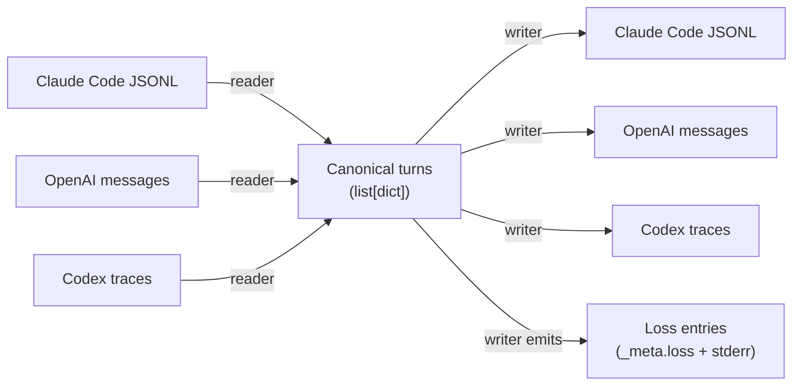

# transcript-bridge — design spec

**Date:** 2026-07-25
**Status:** Retroactive (v0.1.0 already shipped) — documents the as-built design
**One-liner:** A local, offline CLI that normalizes agent session transcripts (Claude Code JSONL, OpenAI messages, Codex traces) into one canonical JSONL envelope and converts between them, reporting every field that has no home in the target format instead of silently dropping it.

This spec is written after the fact because transcript-bridge is the canonical
parser tool other sibling tools are meant to depend on (agent-checkpoint,
transcript-to-test). Its design intent needs to be legible on its own, not
just inferable from the plan/task list that built it.

## Goals

- Convert agent transcripts between Claude Code JSONL, OpenAI messages, and
  Codex traces without silently losing data.
- Normalize every format into one canonical envelope so writers translate
  *from the canonical model*, not pairwise per format-pair.
- Make loss explicit: every field with no native slot in the target format is
  reported (`_meta.loss` + stderr summary), and `--strict` turns any loss into
  a non-zero exit.
- Fully local/offline, read-only on inputs, no telemetry.
- `pipx install .` on Python 3.10+, stdlib only.
- Be the format layer sibling tools reuse, not reinvent.

## Non-goals (v1)

- Streaming/incremental conversion.
- Binary attachment extraction.
- Additional provider formats (Gemini, etc.) — follow-up.
- Merging multiple transcript runs.
- Web UI or hosted service.
- Tape compression or rotation.
- A dynamic plugin system for formats — v1 ships a fixed `FORMATS` dict of
  `(reader, writer)` callables, not a loader.

## Locked design decisions

| Decision | Why |
|---|---|
| Canonical-first architecture: every reader emits `list[CanonicalTurn]`; every writer consumes it | N formats need N readers + N writers instead of N² pairwise converters. Adding format #4 costs one reader + one writer, not three converter pairs. |
| Anthropic-style content blocks (`text`/`tool_use`/`tool_result`) are the source of truth inside `content` | Anthropic's block array is the only shape of the three that preserves ordering of text, tool calls, and cache hints in one list. OpenAI's `tool_calls` array and `role: tool` messages are strictly derivable from it; the reverse (deriving block order from OpenAI's separated fields) loses information. |
| `tool_calls` / `tool_results` on the canonical turn are *derived views*, not independent state | Prevents the two representations (blocks vs. derived list) from drifting out of sync — writers can read whichever is more convenient without reconciling two sources of truth. |
| Loss is a first-class output, not an exception path | A converter that silently drops `cache_control` or a `usage` block is more dangerous than one that fails loudly — the user might not notice for weeks. `_meta.loss` + stderr report + `--strict` make loss visible by default and enforceable on request. |
| Unknown/format-specific fields are split into two buckets: **stashed** in `_meta.source` (no loss entry) vs. **reported** as a loss entry | Not every non-native field is equally important. Round-trippable bookkeeping (Codex `usage`/`checkpoint`, full raw source record) is stashed and silently reappears if the turn goes back to its origin format. Fields that vanish for good when going to a *different* target (`cache_control` → OpenAI, OpenAI tool `name` → Claude) are reported so `--strict` can catch them. |
| Codex format reuses the OpenAI reader/writer internally rather than having its own full parser | Codex records are OpenAI-message-shaped plus a few extra keys (`usage`, `checkpoint`, `command`, `cwd`, `metadata`, `type`, `id`). Stripping those keys into `_codex_extra`, delegating to `openai.read_openai_messages`/`write_openai_messages`, then re-injecting `_codex_extra` on the way out avoids a third near-duplicate parser. Documented in code as a `# ponytail:` simplification. |
| CLI is `transcript-bridge <file> --from X --to Y [-o out] [--strict]`, plus a bare `transcript-bridge formats` / no-args form | Matches the plan's locked CLI contract exactly; the `formats` command has two entry paths (`args.file == "formats"` and the no-file/no-format bare invocation) so both `transcript-bridge formats` and running with no arguments list formats instead of erroring. |
| No dynamic plugin loading; `FORMATS` is a fixed dict built at import time | Ponytail constraint — v1 ships three formats. Dynamic plugin loading is unrequested abstraction until a fourth format is actually needed. |
| Canonical envelope shape is a sibling convention with agent-checkpoint, not shared code | Both projects independently agreed on `{role, content, tool_calls, tool_results, provider, model, ts, ...}` as the turn-level shape (transcript-bridge adds `_meta` for the loss model; agent-checkpoint's is a plain dict without it). No package dependency between them — see "Known gaps" below for why this matters. |
| `selfcheck.py` is a single script with plain `assert`s, no test framework | Matches the rest of the local-first tool suite (tokenauditor, agent-checkpoint) — a self-contained, zero-dependency proof of round-trip honesty is easier to trust than a test-runner invocation with hidden config. |

## Architecture



Pipeline, exactly as run by the CLI: `text → reader(text) → list[CanonicalTurn] → writer(turns) → (output_text, losses)`.

- **Reader**: format-specific text in, `list[dict]` of canonical turns out. Never mutates the input file (read-only).
- **Canonical envelope**: the shared shape every reader emits and every writer consumes (`canonical.py`, "The canonical envelope" below).
- **Writer**: canonical turns in, `(output_text, losses)` out. `losses` is always a plain list, even when empty.
- **Loss report** (`loss.py`): turns a `list[loss-dict]` into a human-readable stderr summary; `--strict` maps a non-empty list to exit code 2.

Codex's reader/writer are a thin wrapper around the OpenAI reader/writer (see locked decisions table) rather than a fourth parallel implementation — this is the one place the "N formats, N readers" rule is bent, and it's bent deliberately, not by accident.

## The canonical envelope

One JSON object per conversation turn, one line per turn in JSONL form:

```json
{
  "role": "user | assistant | system | tool",
  "content": "string, or list of Anthropic-style content blocks (text / tool_use / tool_result)",
  "tool_calls": "list of tool_use blocks derived from content, or null",
  "tool_results": "list of {tool_use_id, content} derived from content, or null",
  "provider": "anthropic | openai | ... (source-format hint)",
  "model": "model name if known, or null",
  "ts": "ISO-8601 timestamp",
  "_meta": {
    "loss": "[] — loss entries recorded against this turn",
    "source": "{} — the raw source record / message, or format-specific extras that have no canonical field"
  }
}
```

Field notes:

- `content` is the one field every writer must be able to serialize. When it's a list, elements follow Anthropic's content-block shape (`{"type": "text", "text": ...}`, `{"type": "tool_use", "id", "name", "input"}`, `{"type": "tool_result", "tool_use_id", "content"}`), regardless of which format the turn came from. The OpenAI reader converts `tool_calls`/`role: tool` into these blocks on the way in; the OpenAI writer converts them back out.
- `tool_calls` / `tool_results` are convenience views derived by the reader from `content` — they are not independently authoritative. A writer that only inspects `content` still sees everything.
- `_meta.source` holds the *entire raw source record* for Claude Code reads (`{"loss": [], "source": record}` — the whole line), and just the extra/non-native keys for OpenAI (`_openai_name`) and Codex (`_codex_extra`) reads. This is where "stashed, not reported" fields live (see locked decisions table) — they ride along invisibly and can be re-emitted if the turn round-trips back to its origin format.
- `_meta.loss` starts empty on every freshly-read turn; it is not currently populated by readers, only referenced by writers, which return their losses as a separate list rather than mutating the turn in place. (The field exists on every turn per the envelope contract, but writers report loss via their return value, not by mutating `_meta.loss` — worth knowing if you're inspecting a turn dict directly rather than reading the `(text, losses)` writer return.)

Canonical helpers live in `transcript_bridge/canonical.py`:

- `make_turn(role, content, *, tool_calls=None, tool_results=None, provider=None, model=None, ts=None, _meta=None) -> dict` — constructs one envelope, defaulting `_meta` to `{"loss": [], "source": {}}` and `ts` to now (UTC) if omitted.
- `read_jsonl(text) -> list[dict]` / `write_jsonl(turns) -> str` — generic JSONL (de)serialization of already-canonical turns, used for the canonical format itself (not a provider format).

## Parser interface (the contract sibling tools should reuse)

Every format module in `transcript_bridge/formats/` exposes exactly two functions with this shape:

```python
def read_<format>(text: str) -> list[dict]:          # canonical turns
    ...

def write_<format>(turns: list[dict]) -> tuple[str, list[dict]]:  # (output_text, losses)
    ...
```

Both are pure functions: text/turns in, text/turns out, no filesystem or network access inside the reader/writer itself (I/O — opening files, reading stdin — happens once in `cli.py`, not inside format modules). This is what makes them reusable as a library, not just as CLI internals: `from transcript_bridge.formats import claude_code; turns = claude_code.read_claude_code_jsonl(text)` works standalone.

Registered in `transcript_bridge/__init__.py`:

```python
FORMATS = {
    "claude_code_jsonl": (claude_code.read_claude_code_jsonl, claude_code.write_claude_code_jsonl),
    "openai_messages":   (openai.read_openai_messages,       openai.write_openai_messages),
    "codex":             (codex.read_codex,                  codex.write_codex),
}
```

`FORMATS` is the lookup table the CLI (`cli.py:_get_rw`) uses to resolve `--from`/`--to` names to callables. It is also the intended reuse surface for other tools: import `transcript_bridge.FORMATS` (or the individual `formats.*` module functions) rather than re-parsing Claude Code JSONL or OpenAI messages from scratch.

## Currently supported provider formats

| Format name | Read | Write | Source shape |
|---|---|---|---|
| `claude_code_jsonl` | yes | yes | Claude Code session JSONL: `{"type": "user"\|"assistant"\|"system"\|"tool", "message": {"role", "content": [...]}, "timestamp"}` per line. Content blocks follow Anthropic's `text`/`tool_use`/`tool_result` shape. |
| `openai_messages` | yes | yes | A JSON array of `{"role", "content", "tool_calls"?}` objects — the OpenAI Chat Completions message shape. `role: tool` messages carry `tool_call_id` and optionally `name`. |
| `codex` | yes | yes | Codex CLI trace JSONL: OpenAI-message-shaped records (`role`, `content`) plus extra keys (`usage`, `checkpoint`, `command`, `cwd`, `metadata`, `type`, `id`) that ride in `_codex_extra`. Implemented as a thin wrapper delegating to the OpenAI reader/writer. |

Not supported (deferred, explicitly out of scope for v1): Gemini, Anthropic Messages API request/response shape (distinct from Claude Code's session JSONL), any streaming/incremental transcript source.

## Loss model

A loss entry (`loss.make_loss(path, source_format, target_format, reason, value)`) is a dict:

```json
{
  "path": "content[0].cache_control",
  "source_format": "claude_code_jsonl",
  "target_format": "openai_messages",
  "reason": "OpenAI messages have no slot for Anthropic cache_control blocks",
  "value": {"type": "ephemeral"}
}
```

Every writer returns `(output_text, losses)` — `losses` is always present, even when empty. `loss.report(losses)` renders the stderr summary; `cli.main` writes it after every conversion and maps a non-empty list to exit code 2 under `--strict`.

Known loss cases in v1 (see README's conversion matrix for the full field-survival table):

- Claude `cache_control` blocks → reported when writing to OpenAI or Codex (Codex delegates to the OpenAI writer, so the loss propagates through that sub-hop).
- OpenAI tool-message `name` → reported when writing to Claude Code JSONL (Claude Code has no slot for it).
- Codex `usage` / `checkpoint` / other extra keys → **not** reported as loss when writing to OpenAI messages (they are stashed in `_meta.source._codex_extra` instead, silently dropped from the serialized OpenAI text); they **are** re-emitted losslessly on a Codex→Codex round-trip.

This stashed-vs-reported split is deliberate (see locked decisions table): stashing avoids false-positive `--strict` failures for information that survives if you stay within a format's own round-trip, while reporting is reserved for information that is genuinely gone once you leave the source format.

## CLI

```
transcript-bridge <file> --from <fmt> --to <fmt> [-o out] [--strict]
transcript-bridge formats
```

- `<file>`: input path, or `-` for stdin.
- `--from` / `--to`: format names from `FORMATS` (`claude_code_jsonl`, `openai_messages`, `codex`).
- `-o`: output file; defaults to stdout.
- `--strict`: exit code 2 if any loss occurred; 0 otherwise.
- `transcript-bridge formats` (or no arguments at all) lists the registered format names, one per line, sorted.
- Loss report always goes to stderr, independent of `--strict` and independent of whether `-o` was given.

## Module map

```
transcript-bridge/
├── transcript_bridge/
│   ├── __init__.py          # __version__, FORMATS registry
│   ├── canonical.py         # make_turn, read_jsonl, write_jsonl
│   ├── loss.py               # make_loss, report
│   ├── cli.py                # argparse CLI: main(argv), _get_rw
│   └── formats/
│       ├── __init__.py
│       ├── claude_code.py    # read_claude_code_jsonl / write_claude_code_jsonl
│       ├── openai.py         # read_openai_messages / write_openai_messages
│       └── codex.py          # read_codex / write_codex (delegates to openai.py)
├── selfcheck.py               # round-trip + loss-report proof, plain asserts
├── pyproject.toml             # pipx-installable, stdlib only, Python 3.10+
├── LICENSE                    # MIT
└── README.md
```

## Testing

`selfcheck.py` builds one canonical transcript containing a Claude-specific
field (`cache_control`) and an OpenAI-specific field (tool-message `name`),
then asserts, using plain `assert` (no test framework, matching the rest of
the local-first tool suite):

1. Claude → Claude is lossless (byte-for-byte turn equality after strip of `_meta`).
2. Claude → OpenAI reports exactly the `cache_control` loss path.
3. Claude → OpenAI → Claude preserves everything except the `cache_control` block (which is verifiably absent) and tool-result content survives.
4. OpenAI → Claude reports the OpenAI-specific `name` field as loss.
5. Codex `usage`/`checkpoint` are captured in `_meta.source._codex_extra` on read, absent (and not reported as loss) when written to OpenAI, and losslessly re-emitted when written back to Codex.

## Known gaps

**Sibling tool `transcript-to-test` does not reuse transcript-bridge's parsers.** It ships its own `transcript_to_test/canonical.py` and `transcript_to_test/readers/{claude_code,openai,tape}.py`, duplicating the Claude Code and OpenAI parsing logic. This is called out explicitly in its own source:

- `transcript_to_test/readers/claude_code.py`: `"# ponytail: duplicates the Claude Code parser shape from transcript-bridge. A shared helper could be extracted later; for v1 each tool keeps its own parser so it stays standalone."`
- `transcript_to_test/canonical.py`: `"Shape mirrors transcript-bridge/agent-checkpoint so the three projects stay conceptually aligned. This module only carries the fields transcript-to-test needs; it does not implement the full loss model."`

So the duplication is intentional and acknowledged, not accidental — each tool was kept installable standalone (no cross-package dependency) at the cost of parser drift risk. Similarly, **agent-checkpoint** defines its own canonical envelope and its own Claude Code / OpenAI parsers (`agent_checkpoint/format.py`, `agent_checkpoint/parsers/`) rather than importing `transcript_bridge` — same pattern, same tradeoff, not currently reconciled.

If transcript-bridge is meant to become the actual shared dependency (per its framing as "the tool everything else will depend on" for a later phase), the next step is not a code change here — it's deciding whether `transcript-to-test` and `agent-checkpoint` should add `transcript-bridge` as a runtime dependency and import its `formats.*` readers/writers directly, replacing their local duplicates. That decision, and the resulting refactor, is out of scope for this spec.

## Scope (v1) — recap

**In:** Claude Code JSONL, OpenAI messages, Codex traces; canonical JSONL envelope; loss reporting with `--strict`; `transcript-bridge <file> --from X --to Y [-o out] [--strict]` and `transcript-bridge formats`; one `selfcheck.py`; stdlib only, Python 3.10+, MIT license.

**Out:** Streaming/incremental conversion, binary attachment extraction, additional provider formats (Gemini, etc.), merging multiple runs, web UI or hosted service, tape compression/rotation, dynamic plugin loading, cross-package parser reuse by sibling tools (see "Known gaps").
